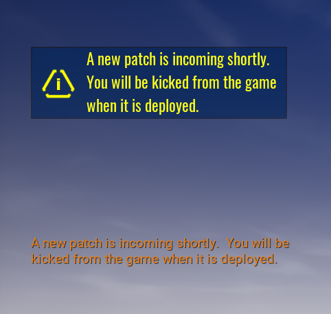

# Patch Notifier Documentation

Welcome to the documentation for the `Patch Notifier` found in [Core](https://coregames.com) Community Content.

This system will allow you to issue a notification to all players currently playing your game so they can prepare for a patch that is incoming.  This is useful for players to know when a patch is about to be deployed so they can be careful about what they are currently doing because when a patch is released, all players get kicked.

This component isn't a simple notification system for the current users on the server.  The patch notification will show to every player currently connected to a server playing your game.

If you want to get up and running quickly, then read the [Quick Start](quick-start) guide.

