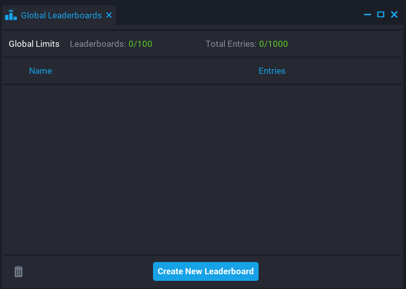
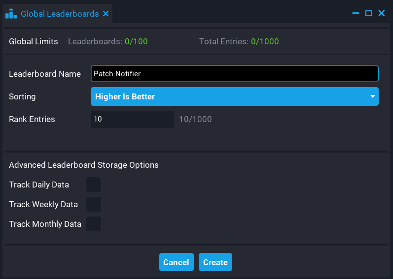
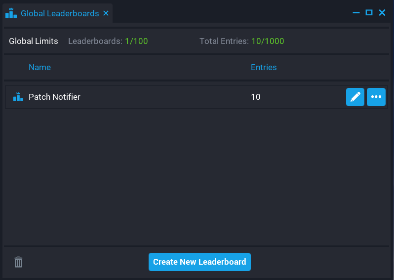

# Leaderboard Setup

You will need to setup a leadeboard for `Patch Notifier` to work.

Open the Leaderboard window by going to Window -> Global Leaderboards.

Next click the "Create New Leaderboard" button.

Enter a name for the leaderboard.  Make sure that the `Sorting` option is set to `Higher Is Better" and that you have 10 `Rank Entries`.

You should now see you have a leaderboard.

Drag and drop the leaderboard onto the `leaderboard` property of the `Patch Notifier` folder in your hierarchy.

