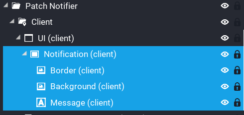

# Customise Notification

The notification can be customise to suit the look of your game, and it's very easy to do.

Expand the `Patch Notifier` folder in your hierarchy and look for the `Notification` panel.



Here you can customise the look of the notification, as well as the message that is displayed.

The message is used for the chat message as well.

If you want to change the location of where the notification comes in at, then you will need adjust 2 lines to change the tweening parameters.

Line 37 of `Patch_Notifier_Client` you will see this...

```Lua
tween = YOOTIL.Tween:new(.6, { x = -400 }, { x = 50 })
```

And on line 48...

```Lua
tween = YOOTIL.Tween:new(.6, { x = 50 }, { x = -400 })
```

Don't forget to setup the anchor / dock settings for the notification.

If there is more interest, then I will consider simplfying this process in the future.  For now a little manual work is needed.